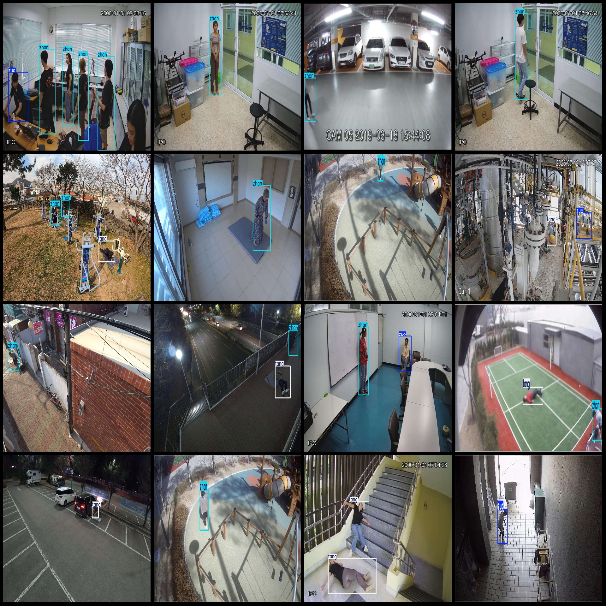
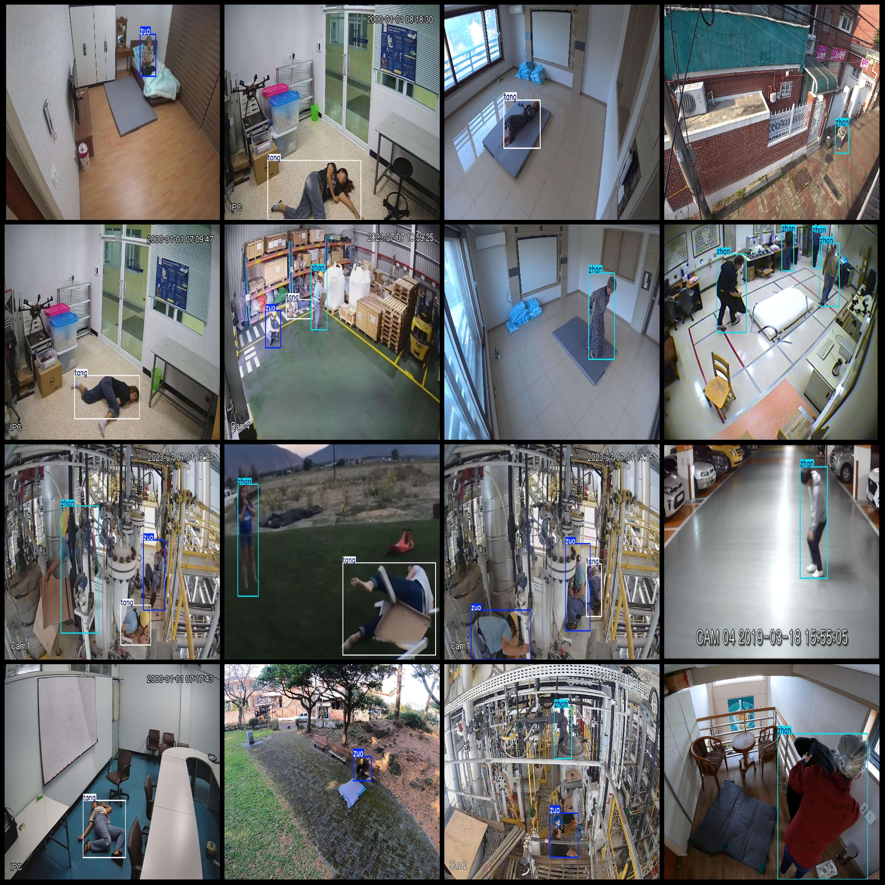

# Dataset: Person Detection, Fall Detection, and Behavior State Monitoring - Pascal VOC + YOLO format (3118 images, 3 classes)

Dataset format: Pascal VOC format + YOLO format (txt files without split paths, only containing jpg images and corresponding VOC format xml files and YOLO format txt files).

Number of images (jpg file count): 3118
Number of annotations (xml file count): 3118
Number of annotations (txt file count): 3118
Number of annotation categories: 3
Annotation category names (note that the order in YOLO format might not correspond to this, but refer to the labels folder "classes.txt"): ["tang", "zhan", "zuo"]
Number of bounding box counts for each category:
- Tang (lying down) bounding boxes = 1411
- Zhan (standing) bounding boxes = 2140
- Zuo (sitting) bounding boxes = 1451
Total bounding boxes: 5002
Number of pictures per category:
- Tang (lying down) pictures = 1207
- Zhan (standing) pictures = 1566
- Zuo (sitting) pictures = 1101
Image resolutions: Images with multiple resolutions, such as 1980x1113, 1980x1320, etc.
Annotation tool used: labelImg
Annotation rules: Drawing bounding boxes for each category
Important note: The dataset does not include a division of the training, validation, and test sets.
Special declaration: This dataset does not guarantee any accuracy in training models or weight files
Image previews:
Annotation examples:
## Images

Here is a pay link on Stripe ( https://buy.stripe.com/3cs8yP7sY87d0vu9AB ). Please contact me lonlonago@foxmail.com after funding $89, and I will send you a complete data files , thank you!

